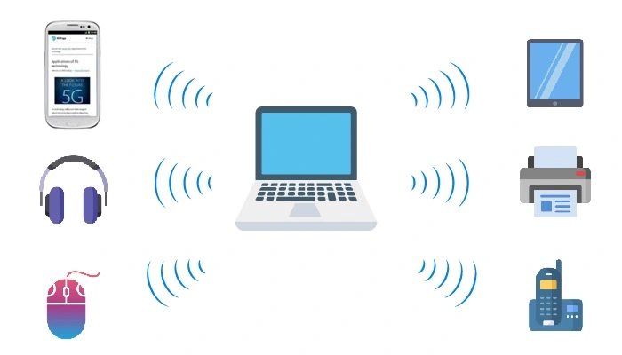
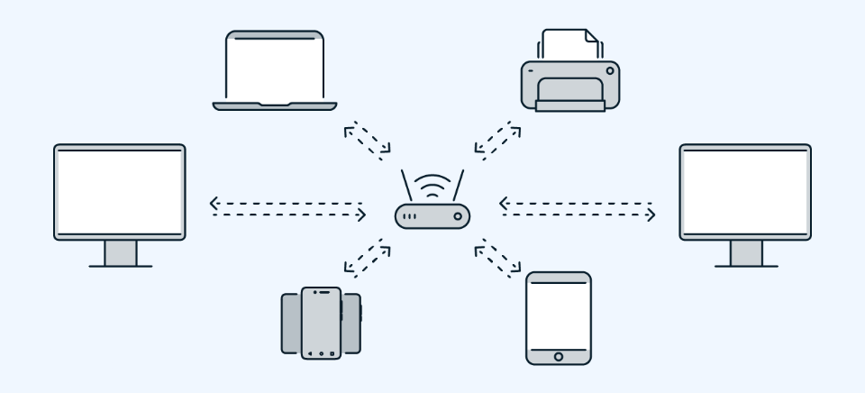
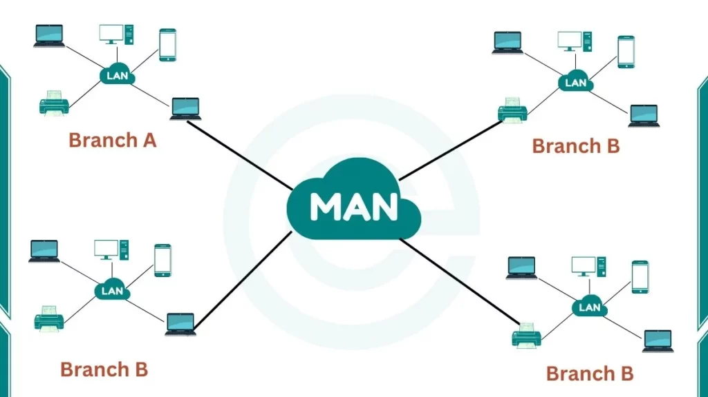
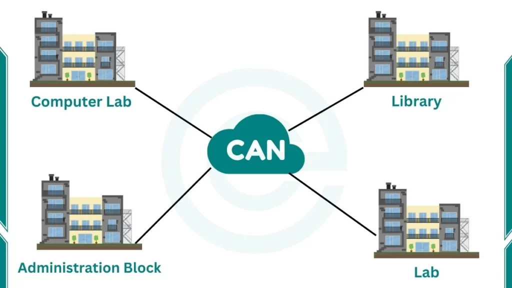
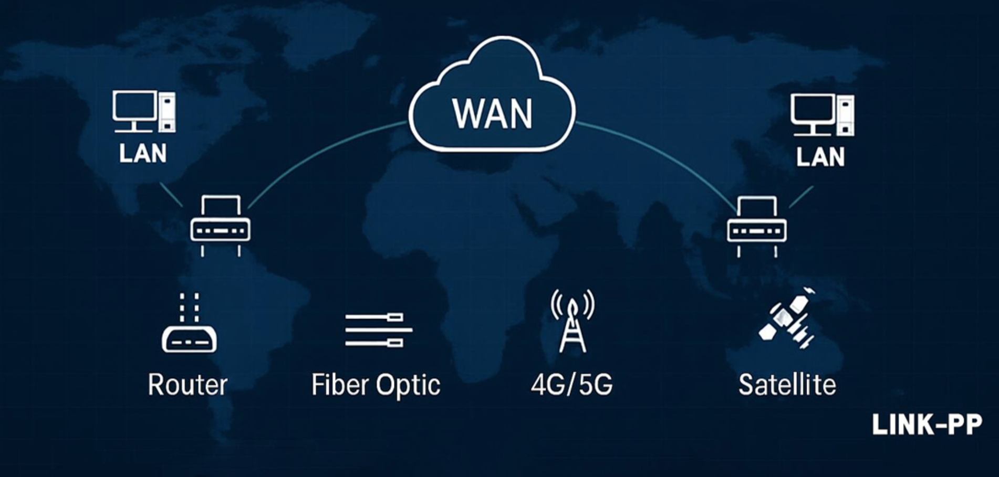

<h1 align="center"><b>NetPractice</b></h1>

> **The goal from this project to discover networking.**    

# Definitions

## Network & Computer Network

### Network in general 

A **network** is a system of **interconnected** elements (nodes, points or people, ...etc) designed to facilitate the movement or exchange of resources, information or communication between them.  

	

### Computer Network

A **Computer Network** is a group of two or more interconnected computing devices (such as computers, servers, printers and other peripherals) that are linked together to **share resources, exchange files, and allow electronic communication**.  

	

## Client-Server Model

Most modern computer networks including the internet use the **client-server model** :  
### Server

Is a hardware or a software system that stores, manages and provides resources, services or data to other devices (clients) on a network;  
The server role is to listen for a requests and then fulfill those requests.  

**Examples of servers :**  
+ Web Server : Stores and delivers web pages(HTML, images ...etc);  
+ Email Server : Send, receive and store electronic mail;  
+ DataBase Server : Hosts and manages a structured collection of data;  

### Client

Is a device or a software that **initiates communication** by **requesting** a service, resource or data from a **server**.  It can be from any end-user device, like desktop, laptop, smartphone or tablet, ...etc.  

	

## Network Types 

### Types by Scale

#### **PAN :**  
PAN stand for **Personal Area Network** and it is just a few meters like the Bluetooth, syncing a phone to a laptop.   

	

#### **LAN :**
LAN stand for Local Area Network for a single room, home, office, building or campus. A typical home Wi-Fi network or all computers in a school library.   

	

#### **MAN :** 
MAN is Metropolitan Area Network used on the large cities or large geographical area covering several buildings. Connecting multiple university campuses across city.  

	

#### **CAN :**  
CAN stand for Campus Area Network, it is a fixed area like a corporate or university campus, often consider a larger type of LAN or a small MAN.  

	

#### **WAN :**  
WAN is the Wide Area Network for the large indefinite area, connecting cities, countries or continents. The **internet** is the largest public WAN corporate network connecting branch office globally.  

	

