<h1 align="center"><b>NetPractice</b></h1>

> **As ALWAYS, we won't just work the project! We will explain everything you need to know about Networking. Of course you can go deeper if you want**    

# Definitions

## Network & Computer Network

### Network in general 

A **network** is a system of **interconnected** elements (nodes, points or people, ...etc) designed to facilitate the movement or exchange of resources, information or communication between them.  

	

### Computer Network

A **Computer Network** is a group of two or more interconnected computing devices (such as computers, servers, printers and other peripherals) that are linked together to **share resources, exchange files, and allow electronic communication**.  

	

## Client-Server Model

Most modern computer networks including the internet use the **client-server model** :  
### Server

Is a hardware or a software system that stores, manages and provides resources, services or data to other devices (clients) on a network;  
The server role is to listen for a requests and then fulfill those requests.  

**Examples of servers :**  
+ Web Server : Stores and delivers web pages(HTML, images ...etc);  
+ Email Server : Send, receive and store electronic mail;  
+ DataBase Server : Hosts and manages a structured collection of data;  

### Client

Is a device or a software that **initiates communication** by **requesting** a service, resource or data from a **server**.  It can be from any end-user device, like desktop, laptop, smartphone or tablet, ...etc.  

	

# Network Types 

## Types by Scale

### PAN
PAN stand for **Personal Area Network** and it is just a few meters like the Bluetooth, syncing a phone to a laptop.   

	

### LAN
LAN stand for Local Area Network for a single room, home, office, building or campus. A typical home Wi-Fi network or all computers in a school library.   

	

### MAN
MAN is Metropolitan Area Network used on the large cities or large geographical area covering several buildings. Connecting multiple university campuses across city.  

	

### CAN
CAN stand for Campus Area Network, it is a fixed area like a corporate or university campus, often consider a larger type of LAN or a small MAN.  

	

### WAN   
WAN is the Wide Area Network for the large indefinite area, connecting cities, countries or continents. The **internet** is the largest public WAN corporate network connecting branch office globally.  

	

## Network types by Topology (Structure)

Topology refers to the physical or logical arrangement of nodes (devices) and the connections (cables/links) between them.  

	

## Network Traffic Types
Network traffic define the relationship between the sender and the receiver(s) on a **network**.  
There is three main traffic types that a network switch handles :   
+ **Unicast :**  It is one-to-one transmission from a single source to a single specific destination;  
+ **Multicast :**  Sending a message to a specific **group** of devices;   
+ **Broadcast :**  Send a message fro one device to **all** the other devices on the same local network, the frame uses a specific destination MAC address : `FF:FF:FF:FF:FF:FF`;  

	

# Network Equipment 

## Repeater 
Its role is to regenerates the weakened network signals to extend the signal's reach over longer distances, the repeater contain only two ports.    

	

## Hub  
Is a multi ports repeater, that broadcasts **any** incoming signal to **all** other ports, without exceptions, so if the sender want to send a message to RECEIVER-3, the Hub send this message to all the RECEIVERS connected to the HUB.

	
	 
	

## Switch
A multi ports RJ45, which connect devices within a single network (LAN). Intelligently forwards data frames based on **mac addresses**, so if a sender want to send a message to RECEIVER-3, even if there is 52 other device plugged in to the switch, only the RECEIVER-3 which gonna get the message.  
So the Switch is much more secure the HUB!  

	
	 
	

**What is MAC address ?**  
Each end-device has it's own **mac address** which stand for Media Access Control and it is a **unique hardware identifier** assigned to a network interface controller (NIC) the physical component that allow a device to connect to a network;  

	

Unlike the **IP** address which is used for global routing, the MAC address is only used for **local communication** within a single LAN segment;  
### How the Switch Works
The internal memory of the switch is called **MAC Address Table** which contain two rows, the port number and the MAC address of the connected device. When the switch powered on the table been empty.   

	

When a frame arrives on a switch port, the switch reads the **MAC addresses** from the frame's header and fill the table with this **MAC** address and the specific ports the frame was received on, so it knows the port and the MAC address of the source and the destination from the frame.    

	

Over time, as devices communicate, the switch fills the entire table.   

## Router 
The router is a networking device that connect **different Networks** together, it acts as a gateway, connecting **LAN** to **WAN** for example connecting the home network with the internet .  
**Hubs & Switches** are used to **create** networks. while **Routers** are used to **connect** networks.  

	
	 
	

### Routing Table

**Routers** use **Internet Protocol (IP)** for routing process.  Routers route data by using the routing table which is like a road map of a car, so the data can travel across the internet and reach its destination it needs **directions** to determine how to get there.  

	

There are three routing types :  
+ **Directly Connected :**  Lets say we connect two networks separated by a router, each one with a specific **IP** address, the router will create automatically the router table with the directly connected routes.  
  When a computer on a `192` network want to connect with a computer on a `10` network, the computer sent a data packet to the router, and the router looks for the destination IP address of the packet, the router looks at the routing table and decide to forward the data out the interface  `Eth1` then to the intended computer.  

	

+ **Static route :** Static routes are manually configured by a network administrator. 
  Lets say the router is connected to another network with the IP `174`, if a computer from the `192` want to connect with a computer from the `174` the router gonna search on the routing table for the interface with this IP address and gonna fail, that when the administrator add the new network `174` to the routing table so the computers of the network `192` could connect with the computers on the network `174`. So to connect back an administrator should add the interface at the other router so the computers on the `174` network could connect to the `192` network computers.  
	

		
	

+**Dynamic routes :** Are similar to the static routes the way it works, the difference is how the routing table is filled, on static routes we fill the table manually but on the dynamic routes we use some protocols so the routing table fill itself automatically, some protocols are : `RIP, OSPF, BGP, IS-IS and EIGPR`.
  So what happen is the routers talk with each other and share their routing tables with each other.  
### How the Router works
+ **Determining the best path :**  When a data packet arrives, the router gets the destination IP address from the header of the packet, then it consult the **routing table** which is a map of network paths to determine the most efficient route and to forward the packet closer to its final destination.  

+ **Forwarding the packet :**  Once the router knows the best route, the router sends the data packet out through the appropriate network interface.  

## wireless access point
A wireless access point **relays** data between a wired network and wireless devices
	

		
	

**Wireless APs** are used primarily by medium and large organisations, they have multiple APs to make sure it covers the entire building

## Bridge
The bridge purpose is to filter, segment and connect two disparate LANs. The bridge contain only two ports.  

	
	 
	

## Bandwidth & Throughput
+ **Bandwidth :** Is the theoretical maximum capacity of a network connection, the upper limit of the amount of data that could potentially be transferred over a connection in a specific amount of time.  
  It is measured in **bits per second**, Mbps or Gbps.
+ **Throughput :** The actual amount of data **successfully** transmitted over a network connection in a specific amount of time.  

	

# Computer Network Models 

There are two main computer network models that serve as reference for understanding and designing how data flows : the **OSI Model** and the **TCP/IP Model**.  

The **TCP/IP Model** is the one actually used for the internet and modern networks, while the **OSI Model** is more detailed, **theoretical** model primarily used for teaching and troubleshooting purposes.  

## Problem the models solved
Between 1960s and 1970s, computer networks were often closed, for example **IBM** networks could only talk to other IBM networks. If a business bought hardware from different manufactures, those systems **could not** communicate with each other, so they are **forced** to buy all their networking equipment from a single company.   

To solve this problem, the **ISO** (International Organisation for Standardization) developed the **OSI** model in 1984 to create a universal blueprint that all the hardware and software manufacturers could follow. By defining **Seven Layers**.  

### Protocol  
Protocol is a standardized set of rules between two or more devices so they could communicate with each other,  just as humans speaks a specific language to communicate, also the computers needs protocols to ensure they can correctly format, transmit, receive and interpret the data they exchange. 

Most used protocols :  
+ **HTTP/HTTPS :** Used by web browsers to request and display web pages (Application Layer); 
+ **IP (Internet Protocol) :** Define the addressing system and routes data packets across the entire internet ( Network Layer);  
+ **TCP :** Ensure data is delivered in accurate way, checking errors, resending lost data and ensuring packets arrive in the **correct** order (Transport Layer);   
+ **DNS, FTP, SSH, SMTP ...etc**

# OSI Model

**OSI** Stand for Open System Interconnecting, the purpose of this model to allow different systems to communicate smoothly regardless of their internal architecture, hardware or software.  

The **OSI** model standardize the functions of communication system into **Seven Layers :**  

	

Each layer of the OSI model encapsulate the data by adding a part to the header of the data so when the data arrive to the server it decapsulate  it 

	

## Application Layer
### Definition
The **application layer** is the primary interface between the user's software application and the network services required to exchange data, it contain the protocols that define the rules for application-level communication, for example when browsing google chrome we use the HTTP protocol to talk across the network.  

	

### header
The application layer encapsulates the data and add to it a header that contain the protocol and information used, still named **data**.    

## Presentation Layer
### Definition
On this Layer we have three steps :  
+ **Translation :**  Converting the data from an application-specific format into a common, **standard** format.
+ **Compression;**
+ **Encryption & Decryption :** 

	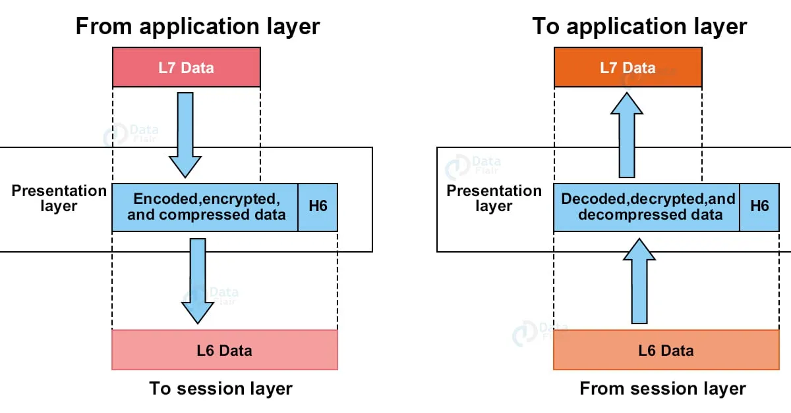

### header
 Contain the information specifying the **data format** used like JPEG, MP4, PDF ... also metadata necessary to correctly decrypt the incoming data, and then information about the compression algorithm used allowing the receiver to decompress the data correctly.
 Still named by data.  
## Session Layer
This layer determine the transmission mode :
+ **Simplex mode :** The communication is fixed in one direction, from a sender to the receiver. Example of the keyboard sending input to a monitor;  
+ **Half-duplex mode :**  Data can flow in both directions but not simultaneously. Example of the walkie-talkie;  
+ **Full-duplex mode :**  Also bidirectional but simultaneously. Example of a phone call.  

	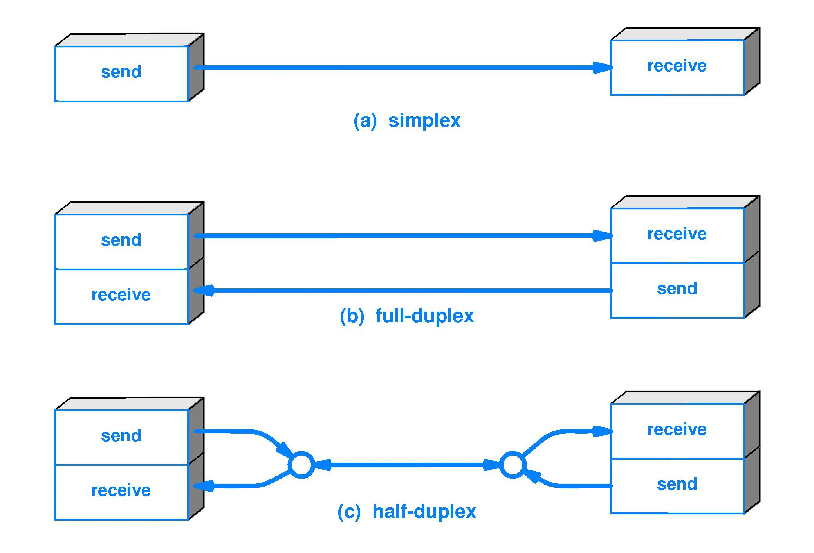

This layer also manage the authentication and the authorization.  
The most important feature it inserts **checkpoints** into the data stream in case the connection fails, the session layer allow the transfer to resume from the last successful checkpoint instead of restarting from scratch.  

	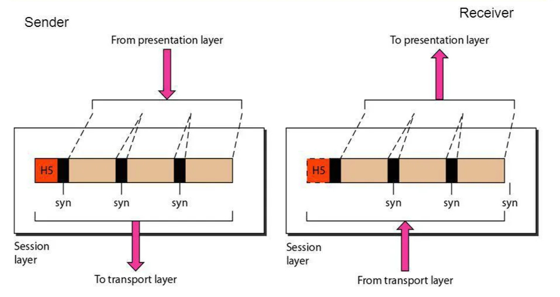

### Header
Contain the numbers indicating where checkpoints are placed, bits defining the communication mode and which device currently hold the right to transmit.  
Still named by data.  

## Transport Layer
This Layer is responsible for data transfer, choosing between **Connection-Oriented** service like **TCP**, and **Connectionless** services like **UDP**.  

### Port Addressing
The Transport Layer is the one responsible for getting the data to the **correct** application on the destination computer, using the **Port Numbers** which are a 16-bit numbers (0 to 65535) added to the header to identify the specific application process

	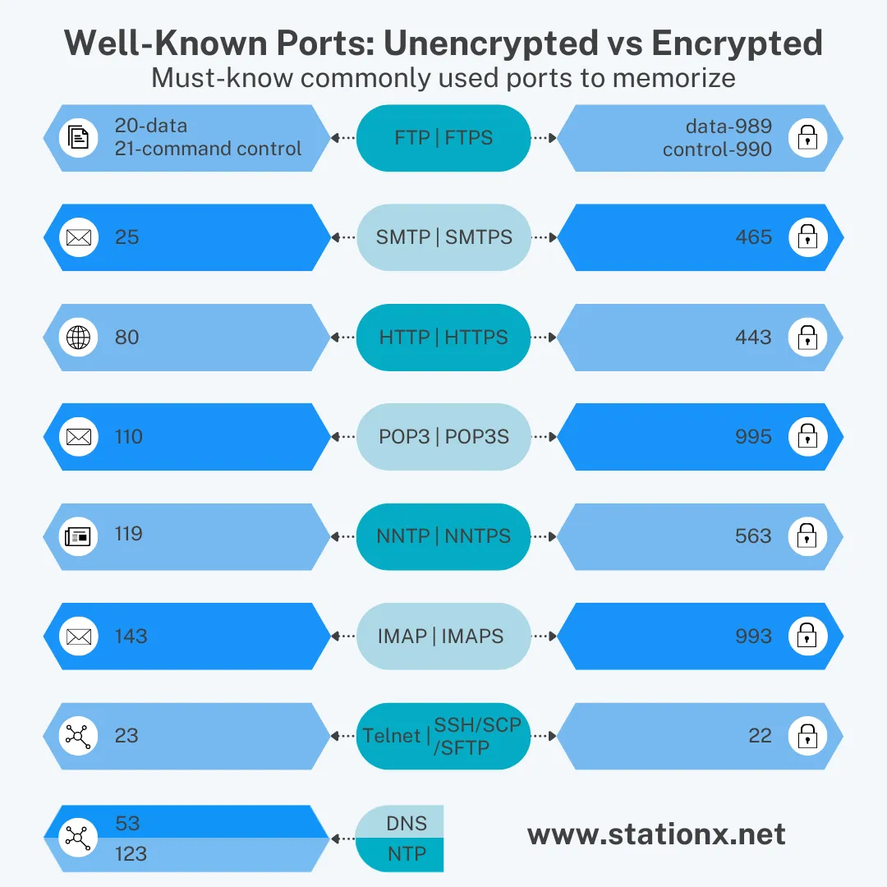

### TCP
#### Segmentation
Happens only on the TCP! Since the physical networks have a limit on the maximum size of data unit, and we don't want any **data lost**, this layer break the data into smaller chunks suitable for transmission as **segments**.

	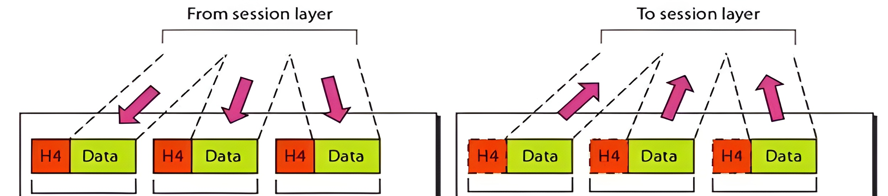

#### Header (Segment)
Each segment is tagged with :  
+ **Source and Destination Ports, data offset, header length ...**  

	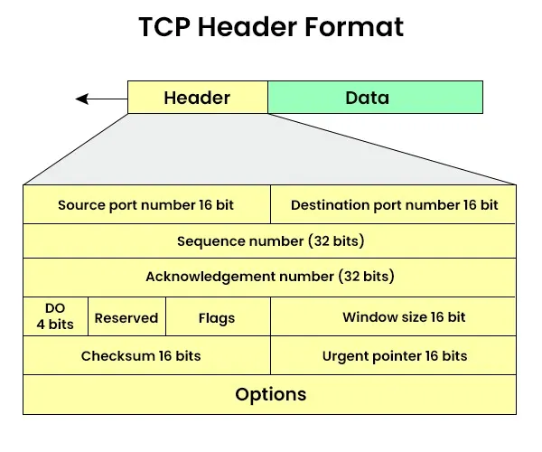

+ **Sequence Number** Indicate the position of the first byte of data carried by the current segment; Helps also to put the segments back together to build the original data before sending it to the Session Layer.    
+ **Acknowledgment Number** Indicate the next expected byte the receiver wait from the sender;  
#### Handshake
Before any data is transferred, TCP make sure both hosts are ready for connection :   
+ **Synchronize :** The client sent the segment proposing the initial sequence number **X** to start communication;  
+ **SYN Acknowledge :** The server reply with a segment includes its own sequence number **Y** and the acknowledge number that equal **X + 1**, so it means am waiting for the next segment.  
+ **Acknowledge :** The client sends a final segment acknowledging the server's sequence number **Y + 1**
 At this point the connection is established and data transfer can begin!  

	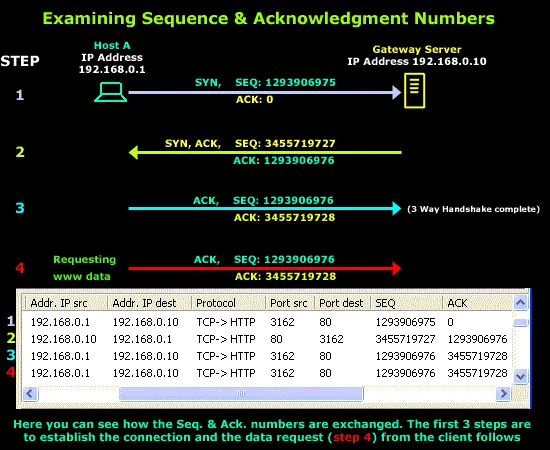

**TCP** guarantees that all data arrives in order and without errors using the system of sequence numbers and acknowledgments.  
The client send a segment and wait the confirmation of the server then continue.  
If the sender does not receive an **ACK** for a segment within a calculated time period, it assumes the segment was **lost** and **retransmits** it again.  
After finishing the data transfer the **TCP** gracefully closes the connection using **FIN (Finish)** and **ACK** segments, ensuring both sides agree to stop sending data.  

	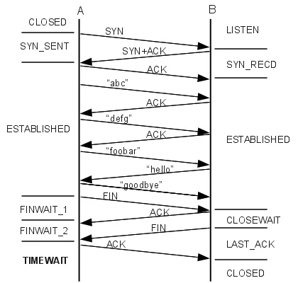

### UDP
#### Definition
**UDP**  stands for User Datagram Protocol, described as "fire-and-forget", provides a connectionless transport service, it doesn't care about the connection with the server, it just send the data even is some is lost it continue sending the rest.  
We use UDP when speed is important than absolute accuracy, UDP is much faster than TCP because it avoid the handshakes, sequence numbering and making sure that the data is received well or not.
#### Header (Datagram)
The UDP header is extremely simple, it contain only four fields :  
+ **Source Port Number;**  
+ **Destination Port Number;**  
+ **Length** (of the entire datagram) **;**  
+ **Checksum** (optional but used for basic error detection) **;**  

	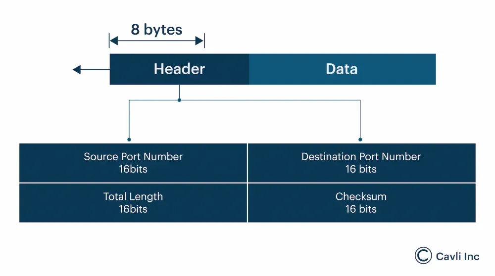

## Network Layer
Four important thing that happen on the Network Layer :  
### Logical Addressing 
#### Problem solved
We used to have a connection between devices in a local network segment using the **MAC Addresses**, the problem they can't be used to address a device across the global internet.  

#### Solution
The Network Layer uses **IP Addresses** for addressing because they are logical assigned by a network administrator or ISP.  
The protocols used are primarily **IPv4** and **IPv6**;  

### Routing
**Routers** use routing table and routing protocols to determine the optimal path for each packet to send data based on it destination IP address.  
Explained on the **Router** part on the network equipment.  

### Encapsulation
The Network Layer receive the **segment** from the Transport Layer and adds its own header which contain the **Source IP Address** and also the **Receiver IP Address** so at the end we got the **Packet**.  

### Header (Packet)
The most important information are the IP addresses of the source and the destination, but the network layer add many fields into the header :  

	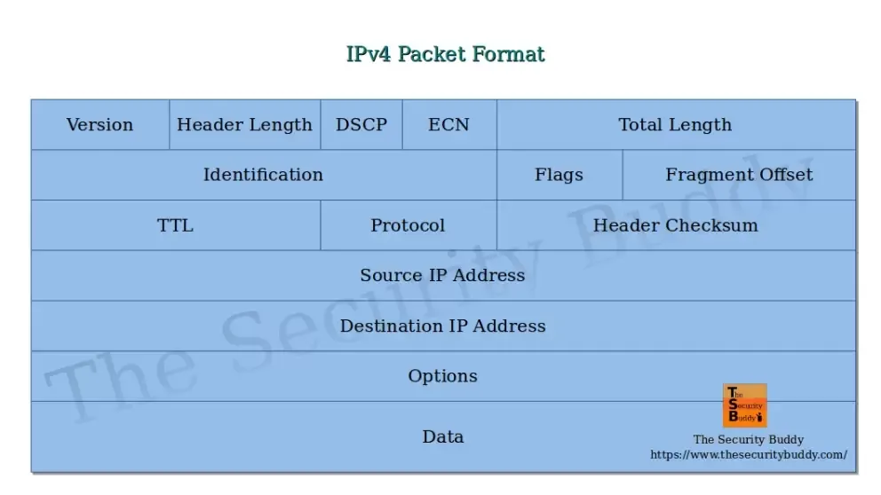

## Data Link Layer
Responsible for node-to-node data transfer, its job is to provide error-free delivery of data frames between two directly connected nodes over a specific physical link.  
#### Header (Frame)
Framing which is encapsulates the packet by adding **Header** and a **Trailer (Footer)** creating a **Frame**  

	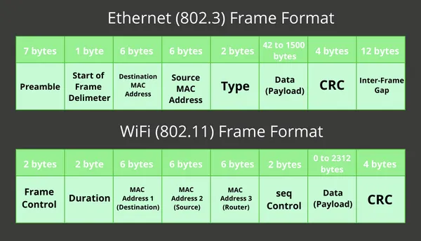

#### Physical Addressing
The Data Link Layer uses **MAC addresses** so the devices on the same local network identify each other so the frame can be delivered to the correct next device.   

#### Error Control
The Data Link Layer adds a **Frame Check Sequence** in the **Trailer** :  
+ **CRC :** This algorithm generate a checksum based on the data in the frame;  
+ **Check :** The sender calculate the CRC and places it in the trailer, the receiver recalculate the CRC for the received data. if the two values do not match, the receiver knows the frame is corrupted and discards it (error detection). 

## Physical Layer
The physical layer is the lowest layer on the OSI model, it deals with the physical connection between devices. Its role is to translate the digital frame  into a physical signal (electrical, light pulse or radio wave) 

	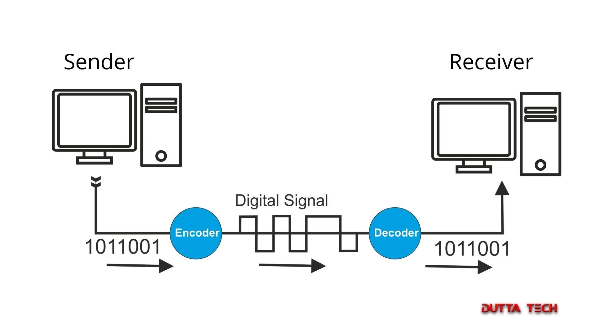

Physical Layer define the characteristics of the physical paths used for communication, either if it is wired (coaxial cable, fiber optic, ...) or wireless (radio frequency).  Also the Physical Layer deals with the physical layout of the network (star, mesh, bus, ring, ...) ;  

## TCP/IP Model

	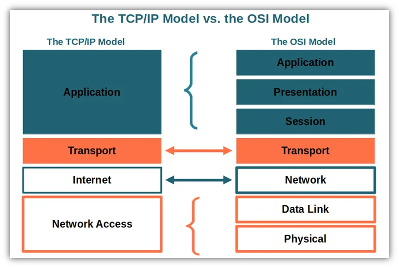

# IPv4 Addressing  

This addressing happen on the Layer 3 the Network Layer, we saw earlier this layer make the addressing which add the source and destination IP addresses to the Data came from Transport Layer .  

## IP (Internet Protocol)
**IP** is not the address itself; it is the primary protocol that operate the Network Layer.  When we say protocol that means its a set of rules that governs the format of data packets.  
The **IP** takes the segment/datagram from the Transport Layer and add the **IP Header** which contain the source and destination IP addresses, creating the **IP Packet**.  

## Basics of IP Address
### What is an IP Address
The **IP address** is a numerical label assigned to every device participating in a computer network that uses the Internet Protocol to communicate.  
Think of it like a street address so the mail service could deliver a letter, network services like web browsers or email need an IP Address to send data to the correct computer.  

	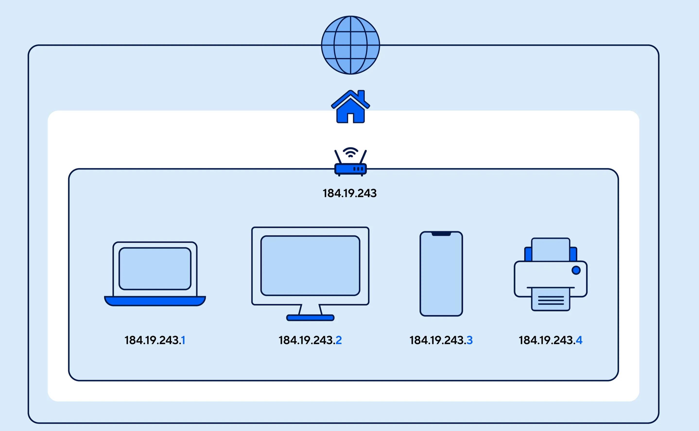

### What is the purpose of the IP Address
The IP Address serve two primary functions :
+ **Identification :**  So each device on the network will have a unique IP address even if two devices with the same name they got two different IP addresses;  

+ **Location (Addressing) :**  The IP Address provides the necessary location information for routing data. Routers reads this address to determine the best path to forward data packet to its destination.  

### The format of an IPv4 Address
The IPv4 Address is a **32-bit number** written in dotted-decimal notation which look like : 
**A . B . C . D**  

	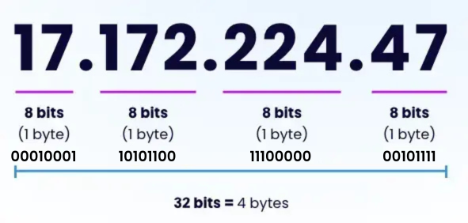

The 32 bits are divided into 4 sections of 8 bits (one octet) each, so the rang from `0` to `255` for each octet  

We see `17.172.224.47` but the computer see `10001101011001110000000101111`  
#### Conversion binary to decimal 
We simply add the values of the positions where the bit is `1` :  

	

So Here the binary `11000000` = `128 + 64` = `192` in decimal.  

#### Conversion decimal to binary
Using the division method and then read from the bottom to the top.  

	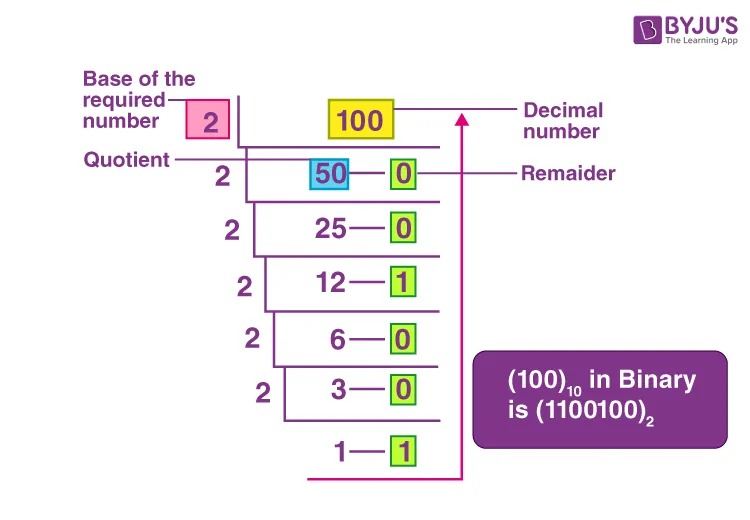

## IP Address Assignment
The assignment of the IP addresses is typically handled at three different levels :  
+ **Global Authority :**  The Internet Assigned Numbers Authority (IANA) manage the overall global IP address space. They delegate large blocks of **Public IP Addresses** to Regional Internet Registries (RIRs);  
+ **Regional/ISP Authority :**  The Regional Internet Registries distribute blocks of addresses to Internet Services Providers and large corporations. Your ISP assigns a **Public IP Address** to the home router, this is the network address to the outside world (the internet);   
+ **Local Network Authority :**  Whiting home or office the **router** assigns **Private IP Addresses** to every device inside the home network (laptops, phones. smart TVs ...etc)

	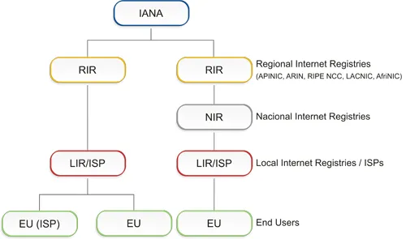

### Local IP assignment (Private IP address)

Those methods manages the addresses for devices insides the home network :  
#### DHCP (Dynamic Host Configuration Protocol)
The Dynamic IP Assignment **DHCP** is the most common method. The IP address is assigned **automatically** and is temporary (it has a lease time).  
The server of the DHCP in my home network is the **router**, its manages  a pool of available IP addresses given by the ISP.  

	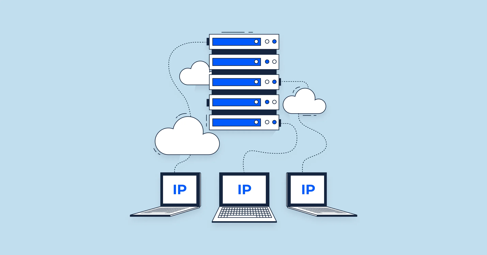

##### How DHCP Works ?
Based on the **DORA** Process, four steps :  
+ **Discover :** When a device turns on, it broadcasts a **DHCP Discover** request :"Is there a DHCP server? I need an IP address!";  
+ **Offer :** The DHCP server responds with the **DHCP Offer** suggesting an available IP address;  
+ **Request :** The device accept the offer and send a **DHCP Request**;  
+ **Acknowledge :** The server sends a final **DHCP Acknowledge** message, finalizing the lease time and also giving the device other essential details like the **Subnet Mask** and **Default Gateway**;  

	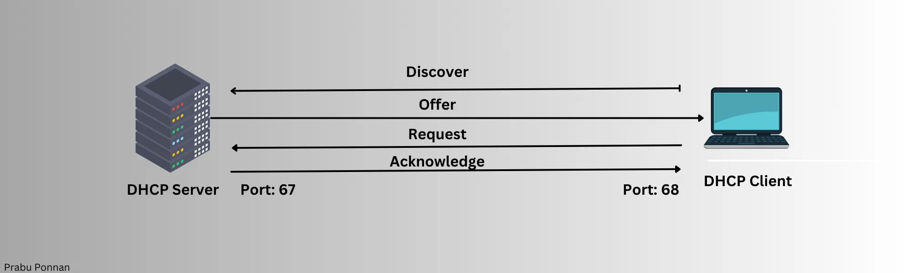

##### Why using DHCP?
+ **Simplicity :** No manual configuration is needed;  
+ **Efficiency :** It prevents **IP conflicts** where two devices accidentally use the same address;  
+ **Scalability :** Perfect for networks where devices frequently join and leave (like Coffee Wi-Fi);  

#### Static IP Assignment (Manual)
The **IP** address being **fixed** and manually configured by a network administrator or user. It been configured for the devices that has the same location every time, for example :  
+ **Servers :** Web Servers, File Servers, Mail servers;   
+ **Network Equipment :** Routers, switches and wireless access points;  

## IPv4 Structure
Every IPv4 address must serve a dual purpose :  
+ Identifying the **location** of the network;  
+ Identifying the **specific device** which is the host.  

	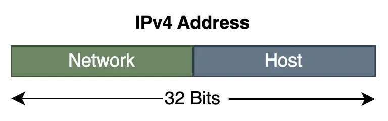

### The Network Portion (Network ID)
Every single device connected to the same local network **must** share an identical Network portion. This Network Portion of the address identifies the **network** itself. its job is to group all the devices that belong to the same local area;  
**Analogy :** If the IPv4 address is an address on a letter, the Network Portion would be the **City** and the **Street Name**.   
Data packets are routed based on this part to get them close to the destination.   

### The Host Portion (Host ID)
This part of the address uniquely identify the **specific device** (the host) within that Network. 
This portion must be unique for every device connected to the same local network.  
**Analogy :** In our last analogy the host portion would be the **House Number**.  
Once the data packet has reached the correct network (the street), the Host ID ensure it is delivered to the correct device (the specific house).  

## Subnet Mask
### Definition 
The Subnet Mask is a 32-bit number just like the IP address that is logically combined with the IP address.  Its the one responsible to tell the device :"Those bits belong to the **Network ID** and the rest belong to the **Host ID**."  
It is also written in dotted-decimal notation like : `255.255.255.0`

### Boundary rule
The Subnet Mask has a strict, unmistakable structure in binary, it is always a **contiguous** string of **ones(1s)** followed be a contiguous of **zeros(0s)**  :  
+ **1s :** This is the **Network Portion** making it mandatory for routing;  
+ **0s :** This is the **Host Portion** to create unique hosts.  

	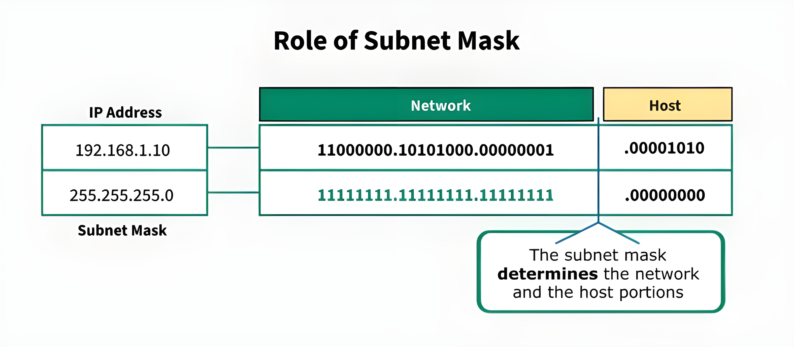

### Classless Inter-Domain Routing (CIDR)
The **CIDR** notation is simply the IP address  followed by a forward slash and the **prefix length** which is the total count of **Network Bits (the 1s).**    
For example :  
+ The mask `255.255.255.0` has `8 + 8 + 8` = 24 bits;  
+ Therefore, the IP address `192.168.1.10` is written in CIDR as `192.168.1.10/24`.  

