<h1 align="center"><b>NetPractice</b></h1>

> **The goal from this project to discover networking.**    

# Definitions

## Network & Computer Network

### Network in general 

A **network** is a system of **interconnected** elements (nodes, points or people, ...etc) designed to facilitate the movement or exchange of resources, information or communication between them.  

	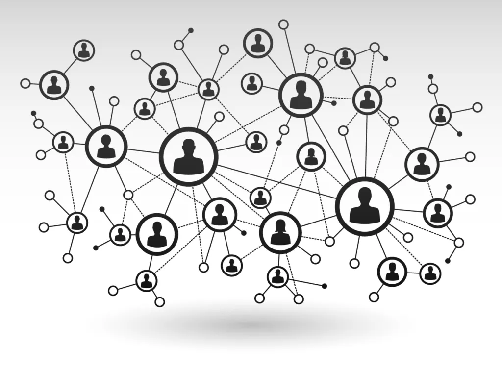

### Computer Network

A **Computer Network** is a group of two or more interconnected computing devices (such as computers, servers, printers and other peripherals) that are linked together to **share resources, exchange files, and allow electronic communication**.  

	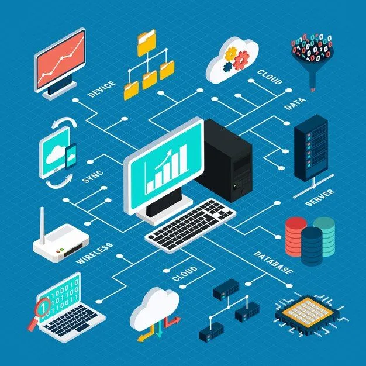

## Client-Server Model

Most modern computer networks including the internet use the **client-server model** :  
### Server

Is a hardware or a software system that stores, manages and provides resources, services or data to other devices (clients) on a network;  
The server role is to listen for a requests and then fulfill those requests.  

**Examples of servers :**  
+ Web Server : Stores and delivers web pages(HTML, images ...etc);  
+ Email Server : Send, receive and store electronic mail;  
+ DataBase Server : Hosts and manages a structured collection of data;  

### Client

Is a device or a software that **initiates communication** by **requesting** a service, resource or data from a **server**.  It can be from any end-user device, like desktop, laptop, smartphone or tablet, ...etc.  

	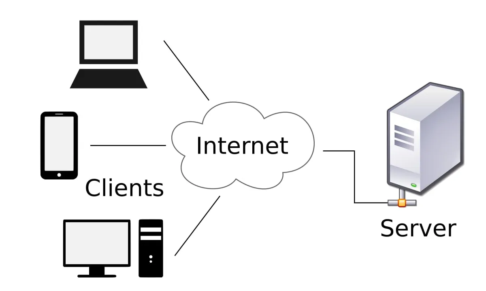

# Network Types 

## Types by Scale

### PAN
PAN stand for **Personal Area Network** and it is just a few meters like the Bluetooth, syncing a phone to a laptop.   

	

### LAN
LAN stand for Local Area Network for a single room, home, office, building or campus. A typical home Wi-Fi network or all computers in a school library.   

	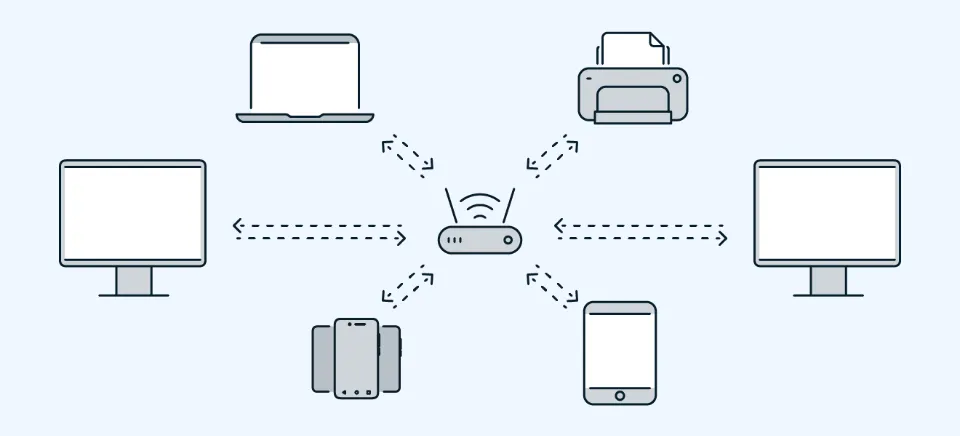

### MAN
MAN is Metropolitan Area Network used on the large cities or large geographical area covering several buildings. Connecting multiple university campuses across city.  

	

### CAN
CAN stand for Campus Area Network, it is a fixed area like a corporate or university campus, often consider a larger type of LAN or a small MAN.  

	

### WAN   
WAN is the Wide Area Network for the large indefinite area, connecting cities, countries or continents. The **internet** is the largest public WAN corporate network connecting branch office globally.  

	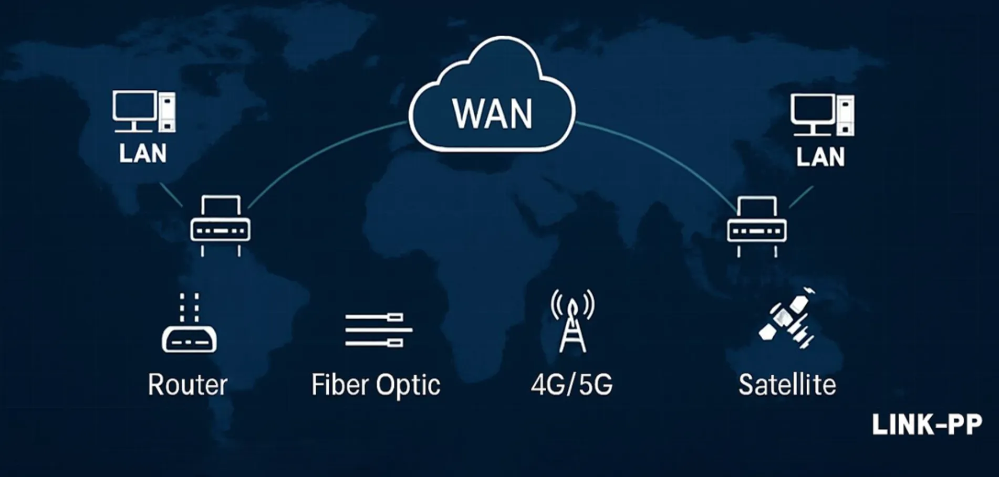

## Network types by Topology (Structure)

Topology refers to the physical or logical arrangement of nodes (devices) and the connections (cables/links) between them.  

	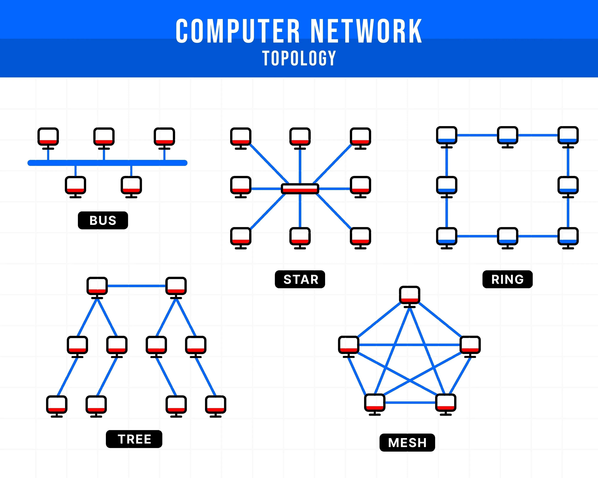

## Network Traffic Types
Network traffic define the relationship between the sender and the receiver(s) on a **network**.  
There is three main traffic types that a network switch handles :   
+ **Unicast :**  It is one-to-one transmission from a single source to a single specific destination;  
+ **Multicast :**  Sending a message to a specific **group** of devices;   
+ **Broadcast :**  Send a message fro one device to **all** the other devices on the same local network, the frame uses a specific destination MAC address : `FF:FF:FF:FF:FF:FF`;  

	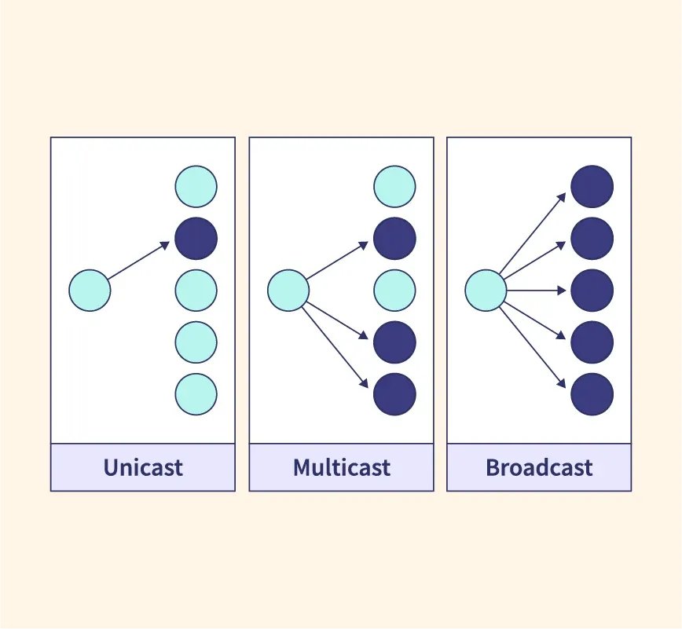

# Network Equipment 

## Repeater 
Its role is to regenerates the weakened network signals to extend the signal's reach over longer distances, the repeater contain only two ports.    

	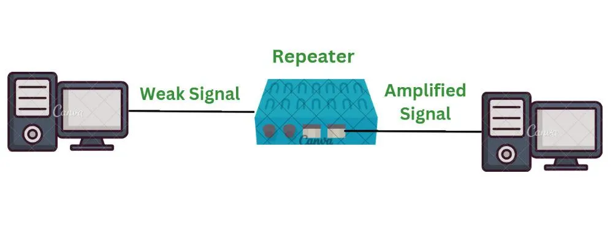

## Hub  
Is a multi ports repeater, that broadcasts **any** incoming signal to **all** other ports, without exceptions, so if the sender want to send a message to RECEIVER-3, the Hub send this message to all the RECEIVERS connected to the HUB.

	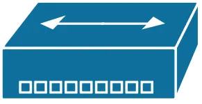
	 
	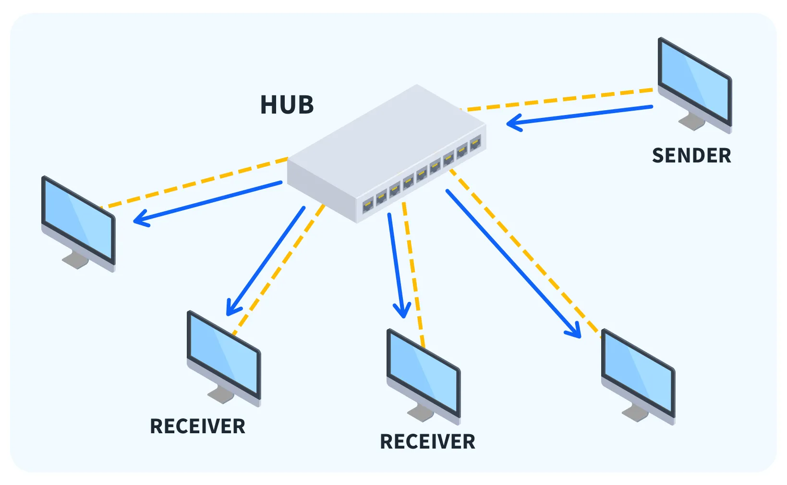

## Switch
A multi ports RJ45, which connect devices within a single network (LAN). Intelligently forwards data frames based on **mac addresses**, so if a sender want to send a message to RECEIVER-3, even if there is 52 other device plugged in to the switch, only the RECEIVER-3 which gonna get the message.  
So the Switch is much more secure the HUB!  

	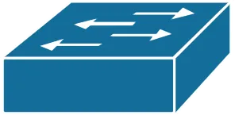
	 
	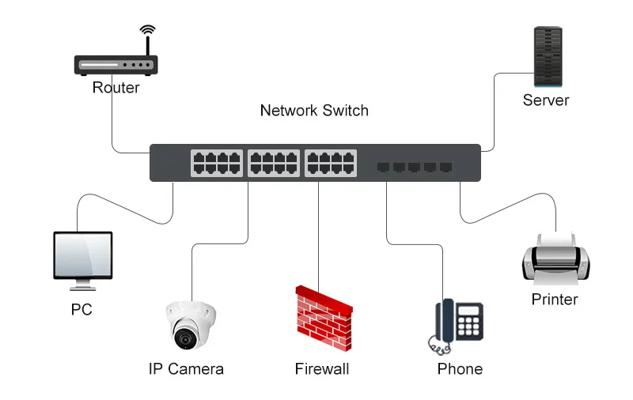

**What is MAC address ?**  
Each end-device has it's own **mac address** which stand for Media Access Control and it is a **unique hardware identifier** assigned to a network interface controller (NIC) the physical component that allow a device to connect to a network;  

	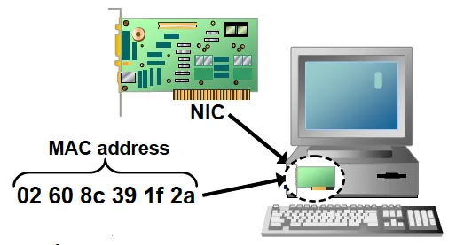

Unlike the **IP** address which is used for global routing, the MAC address is only used for **local communication** within a single LAN segment;  
### How the Switch Works
The internal memory of the switch is called **MAC Address Table** which contain two rows, the port number and the MAC address of the connected device. When the switch powered on the table been empty.   

	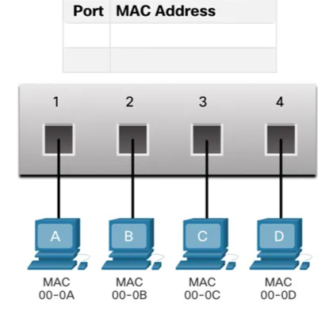

When a frame arrives on a switch port, the switch reads the **MAC addresses** from the frame's header and fill the table with this **MAC** address and the specific ports the frame was received on, so it knows the port and the MAC address of the source and the destination from the frame.    

	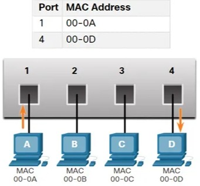

Over time, as devices communicate, the switch fills the entire table.   

## Router 
The router is a networking device that connect **different Networks** together, it acts as a gateway, connecting **LAN** to **WAN** for example connecting the home network with the internet .  
**Hubs & Switches** are used to **create** networks. while **Routers** are used to **connect** networks.  

	
	 
	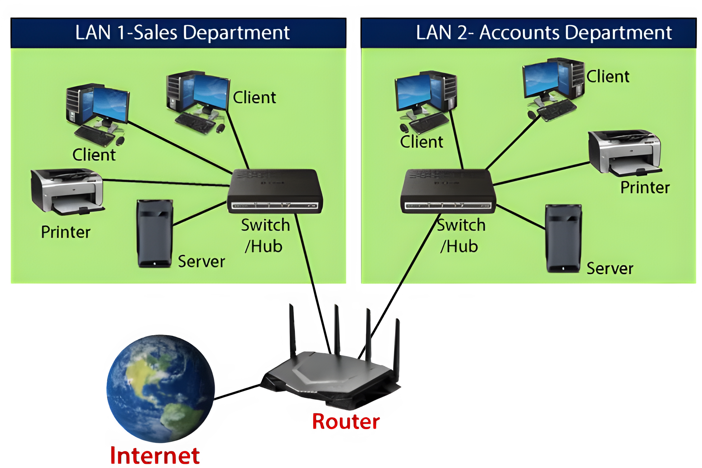

### Routing Table

**Routers** use **Internet Protocol (IP)** for routing process.  Routers route data by using the routing table which is like a road map of a car, so the data can travel across the internet and reach its destination it needs **directions** to determine how to get there.  

	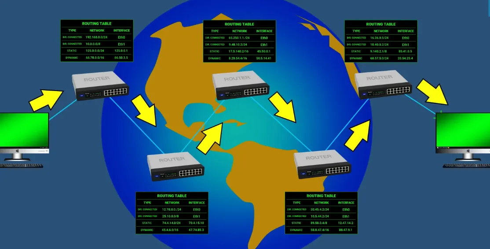

There are three routing types :  
+ **Directly Connected :**  Lets say we connect two networks separated by a router, each one with a specific **IP** address, the router will create automatically the router table with the directly connected routes.  
  When a computer on a `192` network want to connect with a computer on a `10` network, the computer sent a data packet to the router, and the router looks for the destination IP address of the packet, the router looks at the routing table and decide to forward the data out the interface  `Eth1` then to the intended computer.  

	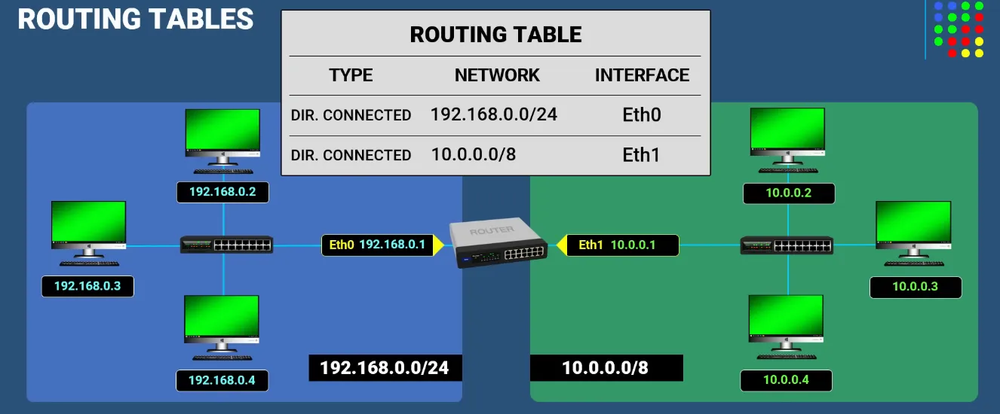

+ **Static route :** Static routes are manually configured by a network administrator. 
  Lets say the router is connected to another network with the IP `174`, if a computer from the `192` want to connect with a computer from the `174` the router gonna search on the routing table for the interface with this IP address and gonna fail, that when the administrator add the new network `174` to the routing table so the computers of the network `192` could connect with the computers on the network `174`. So to connect back an administrator should add the interface at the other router so the computers on the `174` network could connect to the `192` network computers.  
	

		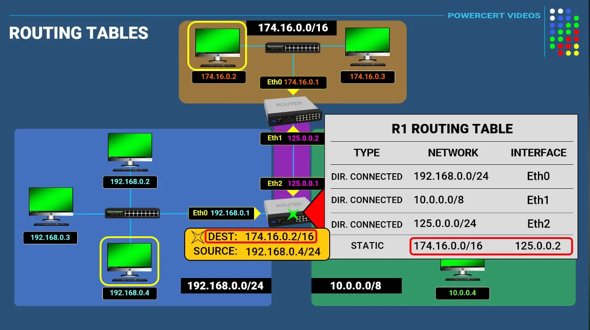
	

+ **Dynamic routes :** Are similar to the static routes the way it works, the difference is how the routing table is filled, on static routes we fill the table manually but on the dynamic routes we use some protocols so the routing table fill itself automatically, some protocols are : `RIP, OSPF, BGP, IS-IS and EIGPR`.
  So what happen is the routers talk with each other and share their routing tables with each other.  
### How the Router works
+ **Determining the best path :**  When a data packet arrives, the router gets the destination IP address from the header of the packet, then it consult the **routing table** which is a map of network paths to determine the most efficient route and to forward the packet closer to its final destination.  

+ **Forwarding the packet :**  Once the router knows the best route, the router sends the data packet out through the appropriate network interface.  

## wireless access point
A wireless access point **relays** data between a wired network and wireless devices
	

		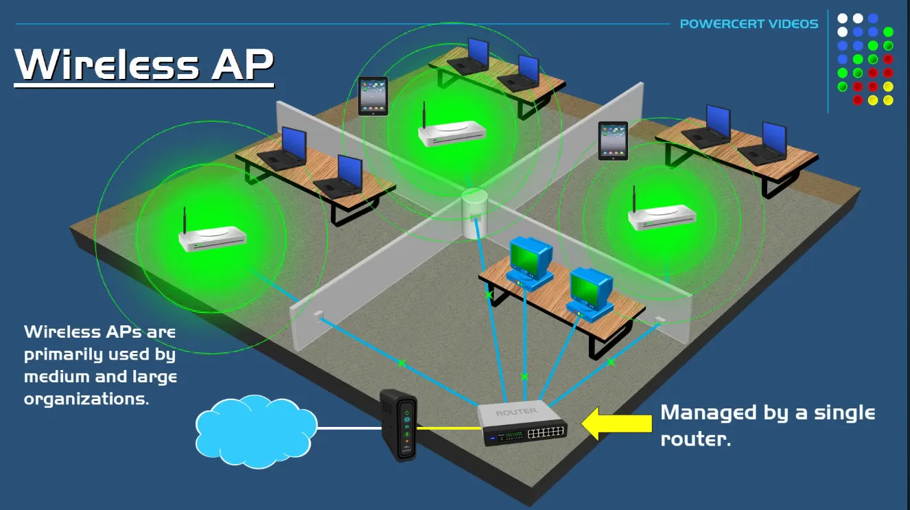
	

**Wireless APs** are used primarily by medium and large organisations, they have multiple APs to make sure it covers the entire building

## Bridge
The bridge purpose is to filter, segment and connect two disparate LANs. The bridge contain only two ports.  

	
	 
	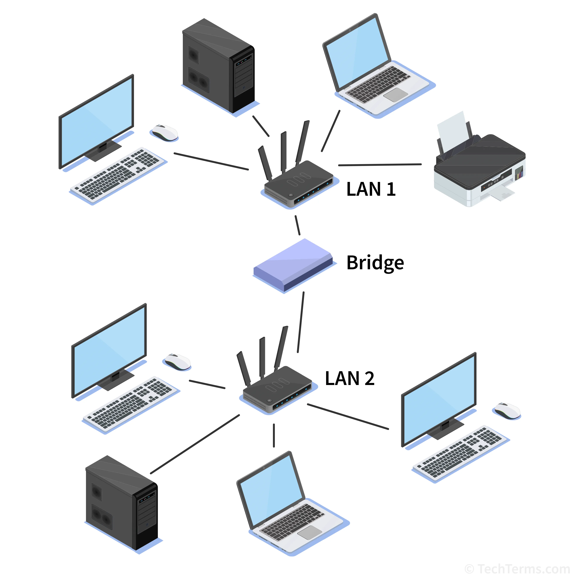

## Bandwidth & Throughput
+ **Bandwidth :** Is the theoretical maximum capacity of a network connection, the upper limit of the amount of data that could potentially be transferred over a connection in a specific amount of time.  
  It is measured in **bits per second**, Mbps or Gbps.
+ **Throughput :** The actual amount of data **successfully** transmitted over a network connection in a specific amount of time.  

	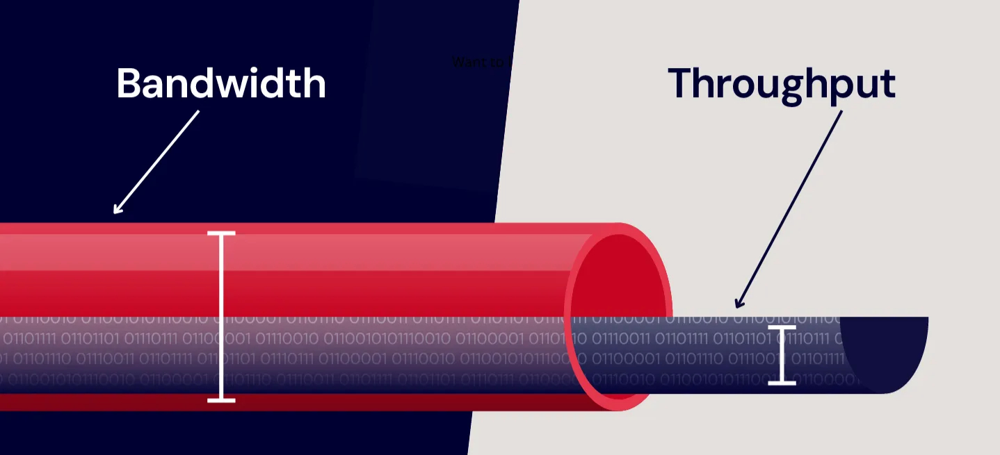

# Computer Network Models 

There are two main computer network models that serve as reference for understanding and designing how data flows : the **OSI Model** and the **TCP/IP Model**.  

The **TCP/IP Model** is the one actually used for the internet and modern networks, while the **OSI Model** is more detailed, **theoretical** model primarily used for teaching and troubleshooting purposes.  

## Problem the models solved
Between 1960s and 1970s, computer networks were often closed, for example **IBM** networks could only talk to other IBM networks. If a business bought hardware from different manufactures, those systems **could not** communicate with each other, so they are **forced** to buy all their networking equipment from a single company.   

To solve this problem, the **ISO** (International Organisation for Standardization) developed the **OSI** model in 1984 to create a universal blueprint that all the hardware and software manufacturers could follow. By defining **Seven Layers**.  

### Protocol  
Protocol is a standardized set of rules between two or more devices so they could communicate with each other,  just as humans speaks a specific language to communicate, also the computers needs protocols to ensure they can correctly format, transmit, receive and interpret the data they exchange. 

Most used protocols :  
+ **HTTP/HTTPS :** Used by web browsers to request and display web pages (Application Layer); 
+ **IP (Internet Protocol) :** Define the addressing system and routes data packets across the entire internet ( Network Layer);  
+ **TCP :** Ensure data is delivered in accurate way, checking errors, resending lost data and ensuring packets arrive in the **correct** order (Transport Layer);   
+ **DNS, FTP, SSH, SMTP ...etc**

## OSI Model

**OSI** Stand for Open System Interconnecting, the purpose of this model to allow different systems to communicate smoothly regardless of their internal architecture, hardware or software.  

The **OSI** model standardize the functions of communication system into **Seven Layers :**  

	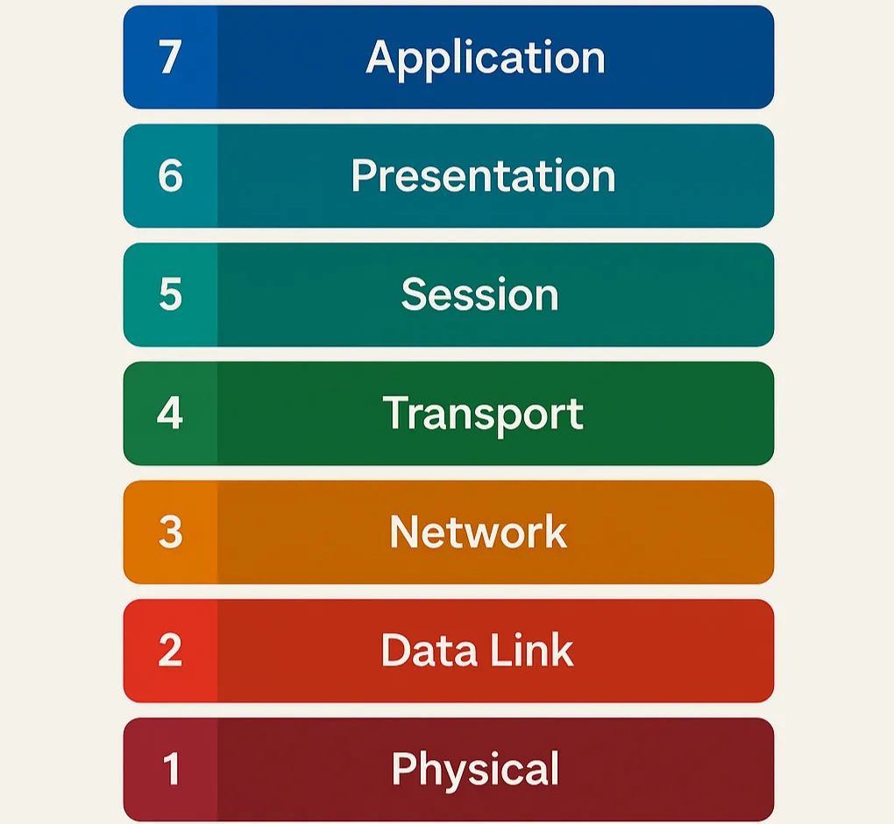

Each layer of the OSI model encapsulate the data by adding a part to the header of the data so when the data arrive to the server it decapsulate  it 

	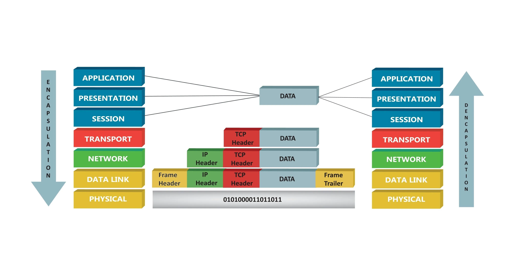

### Application Layer
#### Definition
The **application layer** is the primary interface between the user's software application and the network services required to exchange data, it contain the protocols that define the rules for application-level communication, for example when browsing google chrome we use the HTTP protocol to talk across the network.  

	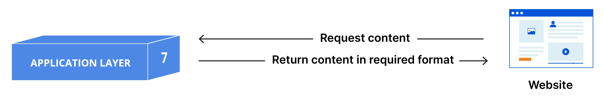

#### header
The application layer encapsulates the data and add to it a header that contain the protocol and information used, still named **data**.    
